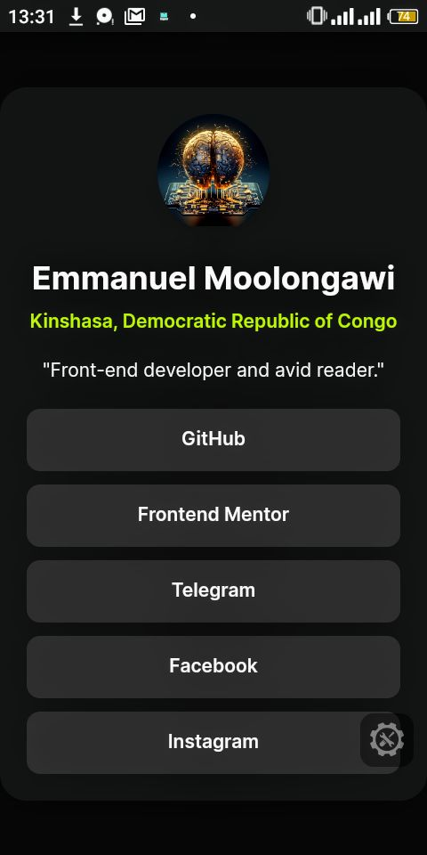

# Frontend Mentor - Social links profile solution

This is a solution to the [Social links profile challenge on Frontend Mentor](https://www.frontendmentor.io/challenges/social-links-profile-UG32l9m6dQ). Frontend Mentor challenges help you improve your coding skills by building realistic projects. 

## Table of contents

- [Overview](#overview)
  - [The challenge](#the-challenge)
  - [Screenshot](#screenshot)
  - [Links](#links)
- [My process](#my-process)
  - [Built with](#built-with)
  - [What I learned](#what-i-learned)
  - [Continued development](#continued-development)
- [Author](#author)

**Note: Delete this note and update the table of contents based on what sections you keep.**

## Overview

### The challenge

Users should be able to:

- See hover and focus states for all interactive elements on the page

### Screenshot



Alternatively, you can use a tool like [FireShot](https://getfireshot.com/) to take the screenshot. FireShot has a free option, so you don't need to purchase it. 

**Note: Delete this note and the paragraphs above when you add your screenshot. If you prefer not to add a screenshot, feel free to remove this entire section.**

### Links

- Solution URL: [Social Links Profil](https://github.com/EMLzmile/social-links-profile)
- Live Site URL: [Social Links Profil](https://emlzmile.github.io/social-links-profile/)

## My process

- I make the structure of my HTML before 
- - I make a container div
- - I add my box container 
- - I split box in 2 parts : profil box and links box
- - For a links I add a a tag in a button and display block my a tag
- I design with my CSS
- - I remove margin and padding of all elements
- - I defined box-sizing to border-box 
- - I defined a container div to body?
- - added a background and color of my container
- - display flex on links box and flex-direction column

### Built with

- Semantic HTML5 markup
- CSS custom properties
- Flexbox
- Variables CSS

### What I learned

```html
<div class="link-container" role="listbox">
  <button class="link-item" role="listitem"><a href="https://github.com/EMLzmile">GitHub</a></button>
  <button class="link-item" role="listitem"><a href="https://frontendmentor.io/profil/EMLzmile">Frontend Mentor</a></button>
  <button class="link-item" role="listitem"><a href="https://t.me/EMLzmile">Telegram</a></button>
  <button class="link-item" role="listitem"><a href="https://m.facebook.com/emmanuel.moolongawi">Facebook</a></button>
  <button class="link-item" role="listitem"><a href="https://instagram.com/emmanumoolongawi">Instagram</a></button>
</div>
```

If you want more help with writing markdown, we'd recommend checking out [The Markdown Guide](https://www.markdownguide.org/) to learn more.

### Continued development

I would like to improve margin use and reduce code's line

## Author

- GitHub - [@EMLzmile](https://github.com/EMLzmile)
- Frontend Mentor - [@EMLzmile](https://www.frontendmentor.io/profile/EMLzmile)
- Telegram - [@EMLzmile](https://t.me/EMLzmile)

